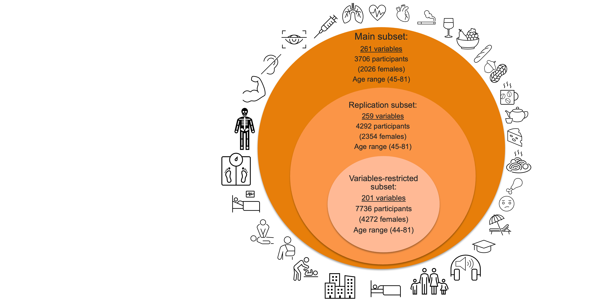

---
# **Brain Age Gap (BAG) Characterisation**
In this directory, we have codes for doing Brain Age Gap Characterisation (Prediction). Here, we have one *.py file for main *.py code for brain age prediction, and one visualization code file.

This directory contains the code used for Brain Age Gap (BAG) characterization (i.e., prediction of BAG based on exposomes). It includes:
- One `*.py` script for BAG characterization (prediction)
- One `*.py` script for visualization

## Data
After computing the Brain Age Gap (BAG) following brain age prediction, we aimed to characterize BAG using a wide range of non-imaging variables — often referred to as **exposomes**.
### Back ground
For the characterization of BAG, we assessed a wide range of non-imaging variables (known as exposomes) encompassing biomedical, lifestyle, socio-economical, early life factors , etc. Previous research has demonstrated a bivariate association between these factors and BAG (or predicted brain age) [[1-5]](#references); Miller et al. at [[6]](#references), showed associations between neuroimaging and non-imaging phenotypes. Additionally, Cole [[4]](#references), Hofmann et al. [[7]](#references), Vidal-Pineiro et al. [[8]](#references), and other related studies, showed non-imaging phenotypes have associations with the predicted predicted brain age and consequently BAG.

### Exposome Selection Process

To select non-imaging variables from the UK Biobank, we followed this multi-step process:

1. **Literature Review:**  
   We reviewed prior studies to compile a broad list of exposomes previously linked to brain health and BAG.

2. **UK Biobank Variable Matching:**  
   We searched the [UK Biobank Showcase](https://biobank.ndph.ox.ac.uk/showcase/) to identify matching or similar data fields corresponding to the variables found in the literature.

3. **Access Verification:**  
   We verified whether each variable was available in our UK Biobank application ([Application ID: 41655](https://www.ukbiobank.ac.uk/enable-your-research/approved-research/characterizing-brain-networks-and-their-inter-individual-variability-by-high-throughput-imaging-and-computational-modelling)).

4. **Instance Selection:**  
   Since UK Biobank often includes multiple **instances** (time points or assessments) per variable, we selected the most appropriate instance for each variable based on relevance and completeness.

5. **Missing Data Assessment:**  
   We aimed to minimize missing data. However, due to the nature of population-scale datasets, complete data for all individuals was not feasible. As a result, we made a trade-off between the number of exposomes and the size of the available sample.

6. **Final Subsets Creation:**  
   After data-cleaning and validation (checking for duplicates, value consistency, and interpretability), we defined **three final exposome subsets**:

   - `subgroup1.csv` → known as *Variables-Restricted* in the paper.  
     (fewer exposomes, larger sample size)

   - `subgroup2.csv` → known as *Replication Subset* in the paper.  
     (intermediate size and variable count)

   - `subgroup3.csv` → known as *Main Subset* in the paper.  
     (richer exposomes, but smaller sample size due to missingness)

## Structure

## Codes

---
## References
1. [Dunås, T., et al., *Multimodal image analysis of apparent brain age identifies physical fitness as predictor of brain maintenance.* Cerebral Cortex, 2021.](https://academic.oup.com/cercor/article/31/7/3393/6159016)
2. [Gaser, C., et al., *BrainAGE in mild cognitive impaired patients: predicting the conversion to Alzheimer’s disease.* PloS one, 2013. 8(6): p. e67346.](https://journals.plos.org/plosone/article?id=10.1371/journal.pone.0067346)
3. [Jawinski, P., et al., *Linking brain age gap to mental and physical health in the Berlin aging study II.* Frontiers in Aging Neuroscience, 2022. 14: p. 791222.](https://www.frontiersin.org/journals/aging-neuroscience/articles/10.3389/fnagi.2022.791222/full)
4. [Cole, J.H., *Multimodality neuroimaging brain-age in UK biobank: relationship to biomedical, lifestyle, and cognitive factors.* Neurobiology of aging, 2020. 92: p. 34-42.](https://www.sciencedirect.com/science/article/pii/S0197458020301056)
5. [Tian, Y.E., et al., *Heterogeneous aging across multiple organ systems and prediction of chronic disease and mortality.* Nature Medicine, 2023. 29(5): p. 1221-1231.](https://www.nature.com/articles/s41591-023-02296-6)
6. [Miller, K.L., et al., *Multimodal population brain imaging in the UK Biobank prospective epidemiological study.* Nature neuroscience, 2016. 19(11): p. 1523-1536.](https://www.nature.com/articles/nn.4393)
7. [Hofmann, S.M., et al., *Towards the interpretability of deep learning models for multi-modal neuroimaging: Finding structural changes of the ageing brain.* NeuroImage, 2022. 261: p. 119504.](https://www.sciencedirect.com/science/article/pii/S1053811922006206)
8. [Vidal-Pineiro, D., et al., *Individual variations in ‘brain age’relate to early-life factors more than to longitudinal brain change.* elife, 2021. 10: p. e69995.](https://elifesciences.org/articles/69995)
