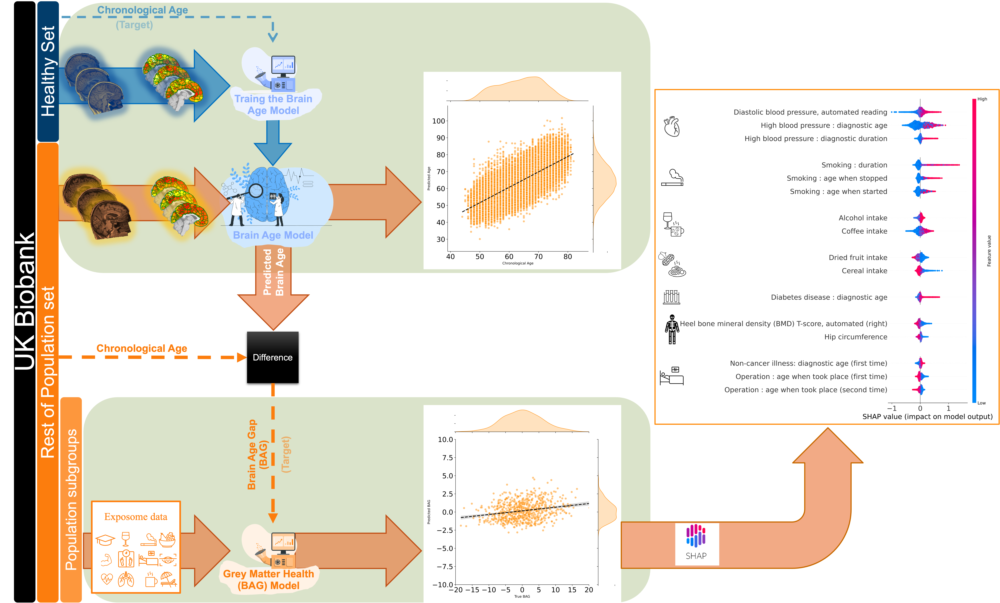

---
# **🧠 What Predicts Individual Brain Health?**
## 📖 Background
Brian Age Gap (BAG) is defined as the difference between an individual's chronological age and the age predicted by a machine learning (ML) algorithm based on individual brain features derived from neuroimaging data. It has been shown that the BAG is in relation to various environmental and lifestyle factors collectively such as medical and biomedical variables, diet and nutrition, social factors, substance use, etc [[1-2]](#references). Among all individual variations, BAG can serve as a general indicator of an individual’s brain health playing a crucial role in the understanding of cognitive aging, the early detection of neurodegenerative conditions, and the evaluation of potential interventions [[3-5]](#references). 

It is therefore essential to enhance the brain structure's health in order to improve the quality of life and well-being of individuals; moreover, as many societies face the challenge of a large portion of the aging population and the increasing pressure on the healthcare systems preventing this, promoting brain health can help them to alleviate some of this burden. 

Therefore, we aim to i) predict the age of the brain ii) calculate the BAG, and iii) finally address this question by using a wide range of biomedical, lifestyle, and sociodemographic variables (known as exposome) conjointly to predict the BAG in a large population.


## 🔄 Workflow

In this project, we aimed first to predict brain age using T1-weighted MRI scans. We leveraged the richness of a well-known large cohort of (cognitively) healthy participants in the [UK Biobank](https://www.ukbiobank.ac.uk/) (under [UK Biobank Application ID: 41655](https://www.ukbiobank.ac.uk/enable-your-research/approved-research/characterizing-brain-networks-and-their-inter-individual-variability-by-high-throughput-imaging-and-computational-modelling)) to develop machine learning (ML) models that predict brain age from structural MRI data (known as imaging variables) on a super healthy group and then tested these models on the rest of the UK Biobank population.

Next, we calculated the gap between predicted brain age and chronological age — known as the **Brain Age Gap (BAG)**. BAG is thought to serve as an important biomarker reflecting pathological processes in the brain.

Subsequently, after calculating BAG, we aimed to characterize it in relation to a range of demographic, biomedical, lifestyle, and other variables (i.e., exposome). We again, utilized state-of-the-art ML models to characterize BAG using the aforementioned exposome. In this stage, the calculated BAG from the previous stage would be the target and exposome are our feature inputs.

Finally, utilizing explainable AI with Shapley values [[6]](#references), by assigning importance to each variable contributing to a prediction, we tried to find the most important exposome on predicting the BAG.




---

## 🗂️ Project Structure

This project consists of two main steps:

- **Brain Age Prediction**
- **BAG Characterization**

Each of these steps has a separate sub-directory with a small `README.md` file describing its content.

```
📁 Mian
├── 📁 1_BrainAgePrediction
└── 📁 2_BAGCharacterization

```
As mentioned, there are two main subdirectories here.

1. `1_BrianAgePrediction`: Code and explanation for Brain Age Prediction

2. `2_BAGCharacterization`: Code and explanation for Brain Age Gap (BAG) Characterization (Prediction)
---


## ⚙️ Prerequisites

Below are the prerequisites for running the code.

- We strongly recommend using **virtual environments** and installing the required packages in an isolated environment. This helps keep the setup clean.  
    - For example, [conda environments](https://docs.conda.io/projects/conda/en/latest/user-guide/tasks/manage-environments.html) are very useful.
- Required packages:
    - [**Scikit-learn**](https://scikit-learn.org/stable/): To train ML models  
    - [**Julearn**](https://juaml.github.io/julearn/main/index.html): To run complex cross-validation designs on top of scikit-learn more easily  
    - [**Optuna**](https://optuna.org/): For hyperparameter tuning using efficient search methods  
    - [**Pickle**](https://docs.python.org/3/library/pickle.html#data-stream-format): To save trained models  
    - [**SHAP**](https://shap.readthedocs.io/en/latest/index.html): To interpret model predictions
---
## References
1.    [Cole, J.H., *Multimodality neuroimaging brain-age in UK biobank: relationship to biomedical, lifestyle, and cognitive factors.* Neurobiology of aging, 2020. 92: p. 34-42.](https://www.sciencedirect.com/science/article/pii/S0197458020301056)
2.    [Tian, Y.E., et al., *Heterogeneous aging across multiple organ systems and prediction of chronic disease and mortality.* Nature Medicine, 2023. 29(5): p. 1221-1231.](https://www.nature.com/articles/s41591-023-02296-6)
3.    [Jónsson, B.A., et al., *Brain age prediction using deep learning uncovers associated sequence variants.* Nature communications, 2019. 10(1): p. 1-10.](https://www.nature.com/articles/s41467-019-13163-9)
4.	[Franke, K. and C. Gaser, *Ten years of BrainAGE as a neuroimaging biomarker of brain aging: what insights have we gained?* Frontiers in neurology, 2019. 10: p. 789.](https://www.frontiersin.org/journals/neurology/articles/10.3389/fneur.2019.00789/full)
5.	[More, S., et al., *Brain-age prediction: a systematic comparison of machine learning workflows.* NeuroImage, 2023: p. 119947.](https://www.sciencedirect.com/science/article/pii/S1053811923000940)
6.    [Molnar, C. (2023). *Interpreting Machine Learning Models with SAP: A Guide with Python Examples and Theory on Shapley Values.* Chistoph Molnar c/o MUCBOOK, Heidi Seibold.](https://christophmolnar.com/books/shap)


